# Impact of human activities on the landscape from above

## Contents  
- [Authors](#Authors)  
- [Requirement](#Requirement)  
- [Usage Description](#Usage-Description)
- [Structure](#Structure)
- [API Description](#API-Description)   
- [Algorithm](#Algorithm)
- [Visualization](#Visualization) 
- [GUI](#GUI) 
- [Copyright](#Copyright)

## Authors
* Group Number: G24  
* Group Member: Huiyu Wang, Han Zucheng, Tian Jian, Yan Xu, Zhang Xiaoang  

## Requirement
* MATLAB 2020a
* Matlab Image Processing Toolbox, Computer vision Toolbox, Statistics and Machine Learning Toolbox  
* The code is tested on Matlab 2020a, with operating system Unix and Windows.  

## Usage Description

* Usage 1: Run the scripts
1. Unzip the file G24.
2. Open Matlab.
3. Click Browse for folder and add file G24 to your workspace.
4. Double-click the file function, all functions are displayed here.
5. Enjoy and have fun! 

* Usage 2: Use GUI  
1. Unzip the file.  
2. Open the 'main.m' in Matlab and run it in the editor.  
3. Choose images in a drop down menu, If users want to test their own images, they must put the images in the folder 'own pictures' in Dataset. Use 'images overview' window you can see the details of the selected images. The software only accepts images in jpg format.  
4. Click on the eight images on the left to select 2 to 4 pictures to compare. If you accidentally clicked on an image twice or unwanted image is chosen, select the image set again as in step 3 and then click on 'Reset' on the bottom right corner.

5. After the selection is over, click the button 'ready and start'. Now the common parts of the four images will be projected on the same image. This image will pop out, users need to double click a point on the image to get an area to analyze the changes in this area.the common parts will be shown in GUI.(pic1 to pic4). 

6. User can choose 2 images to show highlights. Threshold and other parameters can be given by users. To change the mode quick/slow, you can choose KAZE or SURF method to find the highlights part of the image.

7. Before applying other visualization methods, users must use k-means to classify the components in the image. Users should type in the 'Number of clusters' and 'Iteration'. We can name related clusters according to the situation and enter the names of each class，and click ‘√’to confirm.

8. click the Button 'ready and start' and the clustering process begins.

9. After the clustering process is finished, you will see a figure of subplot containing the resulting clusters. The same cluster from different years should be plotted in the same column. If find any of them is in the wrong column, click 'Change the order' and fix it manually.

10. Please name the clusters from left to right within the next input box. Notice that you must divide the names with ';'. Before you click '√' here, please click on 'Heatmap' firstly and also give the names of image pair here, which you want to compare according to the names you have given with the format: 'name_of_cluster11'. 'name_of_cluster1' is the name of your first cluster you have given in step 9. The last number '1' corresponds to the first image you have chosen in step 4.

11. Click on 'Bar Map', then click '√' to see the changes in form of bar chart.

12. Click 'Time Lapse', user can change the tempo(quick/middle/slow) here. After clicking on ‘√’,the time slides will be played. user can stop playing by clicking any letter on the keyboard.

13. Please always click on 'Reset' on the bottom right corner when you are finished with comparison of the images you chose.

## Structure  

+--G24  
 |   +--lib  
 |      +--all_clear.m  
 |      +--appendimages.m  
 |      +--auto_mask_sort.m  
 |      +--all_clear.m  
 |      +--cake.m  
 |      +--color_masks_rgb.m  
 |      +--construct_containers.m  
 |      +--construct_dates_common.m  
 |      +--findHomography.m  
 |      +--give_names.m  
 |      +--Highlights_Finden_Visualization.m  
 |      +--Images_Same_Area_New.m  
 |      +--img_percentage.m  
 |      +--imMosaic.m  
 |      +--kmeans.m  
 |      +--PCA_Highlights.m  
 |      +--plot_bar.m  
 |      +--plot_heatmap.m  
 |      +--plot_rgb.m  
 |      +--randIndex.m  
 |      +--ransac1.m  
 |      +--solveHomo.m  
 |      +--swap.m  
 |      +--time_lapse.m  
 |   +--misc  
 |      +--Readme.txt  
 |   +--1.jpg  
 |   +--2.jpg  
 |   +--DialogWindow.mlapp  
 |   +--DialogWindow_exported.m  
 |   +--main.m  
 |   +--main_project.mlapp  
 |   +--doc-G24.pdf  

## API Description
--------------------
all_clear.m
--------------------

Function:
This function will clear the work space and plots. All data in work space and also the plots should be deleted/closed after the program is finished.

--------------------
appendimages.m
--------------------

Function:
Put two pictures together(image1, image2)
Select the image with the fewest rows and fill in enough empty rows to make it the same height as the other image. Return a new image that appends the two images side-by-side.

--------------------
auto_mask_sort.m
--------------------

Function:
Align and display the result pictures of k clustering.
This function sort the k clusters after the clustering is finished in the output cell arrays, the most similar clusters are all aligned in the same row of the cell arrays, which will be shown later through the function plot_rgb() in the same column.

--------------------
cake.m
--------------------

Function:
After finding the centroid of the highlight, project a rectangle with the centroid as the center and length min on the image to get the highlight.
According to the position marked by the user on the map, determine the common part to be found. It helps us identify the common parts on the image
This function is used by images_Same_Area_New.m 

--------------------
color_masks_rgb.m
--------------------

Function:
K-means Clustering.
Input of this function:
This function takes the common part of two images as input In this function, k-means clustering will be applied in order to extract the color information of the common part. The possible input for the users on the interface are following:
The number of colors: user can change their decision if the initial estimation was not successful enough.
Output of this function:
Output is the percentage of each color in the common part of the two images.

--------------------
construct_containers.m
--------------------

Function:
Conastructing mask and image containers.
   * names          : matrix of string, which contains the names of the layers
   * size of name: determined by the input of user: when the user decided, how many clusters and compared       images he wants to have
   * rows             : number of clusters
   * columns       : number of compared images
 

--------------------
construct_dates_common.m
--------------------

Function:
Extract the dates from the first column and the images from the second column.

--------------------
findHomography.m
--------------------

Function:
Find the homography between two planes using a set of corresponding points. 
PTS1 = [x1,x2,...;y1,y2,...]. RANSAC method is used.corrPtIdx is the indices of inliers.

--------------------
give_names.m
--------------------

Function:
The user assigns a label to each clustering result.
The variable names is an array of strings, whose size should be k*1, 
e.g. names = ['city', 'beach', 'sea']
where k is the given number of user, which indicates the number of clusters that the user wants to have.
names_out should be an array of size k * num_img.

--------------------
Highlights_Finden_Visualization.m
--------------------

Function:
Find the highlights between two images.
Using the function imMosaic() to find the same area of two images.
The images just need to be subtracted from each other, and we add the two difference value.
Analyze the highlights of the same area by binarization method
   * Speed     :Select the ways(SURF/KAZE) to image registration.
   * Speed     :-"quick" Using SURF method, it is quick,but the accuracy is poor.      images he wants to have
   * Speed     :-"slow" Using KAZE method, it is slow,but the accuracy is higher.
   * Tau_Area:  The smallest highlights area in the sum of area. 
   * Thresh     :The binarization threshold value
   * min_dist : The radius of the centroid

--------------------
Images_Same_Area_New.m
--------------------

Function:
Find the same area of the set of images.
It can accept any number of pictures to find common parts. 
The first column is the date the picture was taken, and the second column is the picture.
   * min_dist        :The Picture size. Picture_size=2*min_dist+1
   * n_matchings : It is the number of matched pictures.
   * I_out              :The first column is the date the picture was taken, and the second column is the same area that we find in pictures

Note:
If you are not satisfied with finding the common parts of the picture, you can try this function of finding common parts several times to find the most suitable common parts.

--------------------
img_percentage.m
--------------------

Function:
 Function will operate the pixels in a block (e.g. of size 10*10). The input images has nonzero entries, where the pixel belong to the certain color mask. The number of the 'true' pixels will be counted for both images. The percentage of 'true' pixels will be calculated for the block. Output should be the difference between of the percentage from last step.

--------------------
imMosaic.m
--------------------

Function:
Image correction function.
Img1 and img2 can (both) be rgb or gray, double or uint8. If you have more than 2 images to do mosaic, call this function several times. If you set adjColor to 1, imMosaic will try to try to adjust the color(for rgb) or grayscale(for gray image) of img1 linearly, so the 2 images can join more naturally.
   * Speed        :Select the ways(SURF/KAZE) to image registration.
   * Speed        :-"quick" Using SURF method, it is quick,but the accuracy is poor.
   * Speed        :-"slow" Using KAZE method, it is slow,but the accuracy is higher. 
   * Tau            :The threshold of finding feature points by SURF/KAZE method.
   * thDist        :The threshold of distance is used by ransac method to find Homography H.
   * thInlrRatio:  The threshold of thInlrRatio is used by ransac method to find Homography H.
Partial reference: Ke Yan (2021). image mosaic using SIFT (https://www.mathworks.com/matlabcentral/fileexchange/30849-image-mosaic-using-sift), MATLAB Central File Exchange. Retrieved July 8, 2021.

--------------------
PCA_Highlights.m
--------------------

Function:
Find the highlights between two images.
Using the function imMosaic() to find the same area of two images.
The images need to be subtracted from each other, and we use PCA method to find highlights of images.
Analyze the highlights of the same area by binarization method.
   * Speed     :Select the ways(SURF/KAZE) to image registration.
   * Speed     :-"quick" Using SURF method, it is quick,but the accuracy is poor.
   * Speed     :-"slow" Using KAZE method, it is slow,but the accuracy is higher.      
   * Tau_Area:  The smallest highlights area in the sum of area. 
   * Thresh    :The binarization threshold value
   * min_dist :The radius of the centroid
Partial reference: rulixiang(Feb 2019) ChangeDetectionPCAKmeans https://github.com/rulixiang/ChangeDetectionPCAKmeans

--------------------
plot_bar.m
--------------------

Function:
This function will produce bar-diagram based on the output of the last function Color_Masks_rgb()
The input is a cell array, which contains different color masks, where the entry of matrices are of type logical so that we can easily apply the MATLAB build-in function find() to determin how many pixels of a class(colors) are there that we clustered from the last step.
cell_img: the cell array of common part of compared images, whose first column are the corresponding dates.

--------------------
plot_heatmap.m
--------------------

Function:
Visualization with heat map.
input 1: the first image choice (of an earlier datetime).
input 2: the logical matrix of the first image choice.
input 3: the logical matrix of the second image choice.
input 4: window size for computing percentage of change in this window.
input 5: transparence of the heat map, which will overlay on img1.
output: the resulted heat map overlaying on the first imge choice (of an earlier datetime)

Note:
the larger the window size, the less misstake because of the wrong correspondences or wrong clutsering will be less presented. However when the user choose the window size smaller, the location of the changes will be shown more precisely in the heat map.

--------------------
plot_rgb.m
--------------------

Function:
Generating subplot of the resulted clustering

--------------------
randIndex.m
--------------------

Function:
Random number seed function
Randomly extract four points from the matching points and calculate the matrix H. Find the same distance and iterate.

--------------------
ransac1.m
--------------------

Function:
Kick-off Outliers.
Use RANdom SAmple Consensus to find a fit from X to Y. 
X is M*n matrix including n points with dim M, Y is N*n;
The fit, f, and the indices of inliers, are returned.
RANSACCOEF is a struct with following fields:
minPtNum,iterNum,thDist,thInlrRatio
MINPTNUM is the minimum number of points with whom can we find a fit. For line fitting, it's 2. For homography, it's 4.ITERNUM is the number of iteration, THDIST is the inlier distance threshold and ROUND(THINLRRATIO*n) is the inlier number threshold.
FUNCFINDF is a func handle, f1 = funcFindF(x1,y1)
x1 is M*n1 and y1 is N*n1, n1 >= ransacCoef.minPtNum
f1 can be of any type.
FUNCDIST is a func handle, d = funcDist(f,x1,y1)
It uses f returned by FUNCFINDF, and return the distance between f and the points, d is 1*n1.
For line fitting, it should calculate the dist between the line and the points [x1;y1]; for homography, it should project x1 to y2 then calculate the dist between y1 and y2.

--------------------
solveHomo.m
--------------------

Function:
Calculate the matrix H according to the Image 1 and Image 2 given.

--------------------
solveHomo.m
--------------------

Function:
Image interchange function.

--------------------
time_lapse.m
--------------------

Function:
This function will output the time lapse for visualization

Note:
The user should input whether 'quick', 'middle' or 'slow' to determine the tempo of image switching by typing any letter on the keyboard, the loop will come to break.  

## Algorithm

* Image processing algorithm  
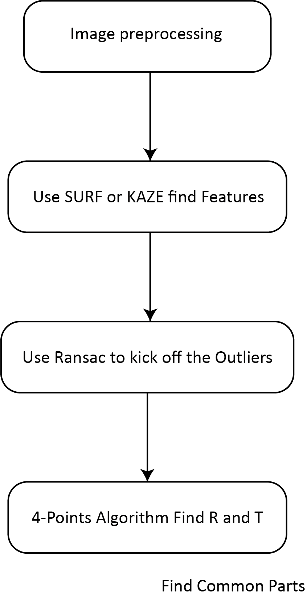
*  SURF  
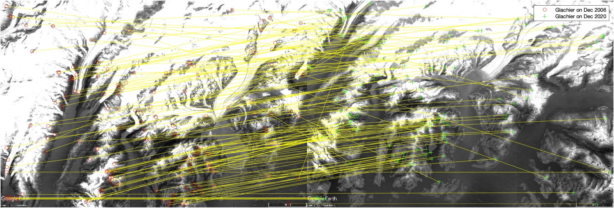
* Ransac  
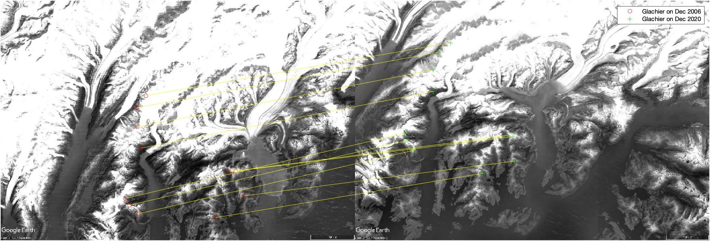  
[SURF Correspondences after RanSac]  
* KAZE  
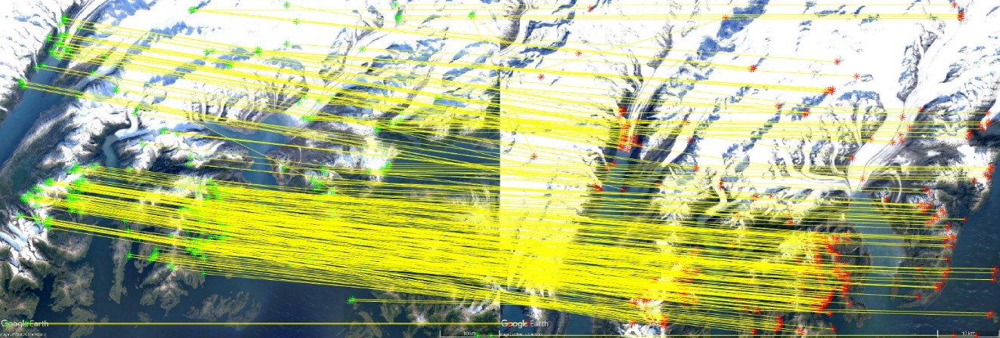  
*  4-points algorithm  
 
[ Image Registration]  

##  Visualization

* Flow chart  
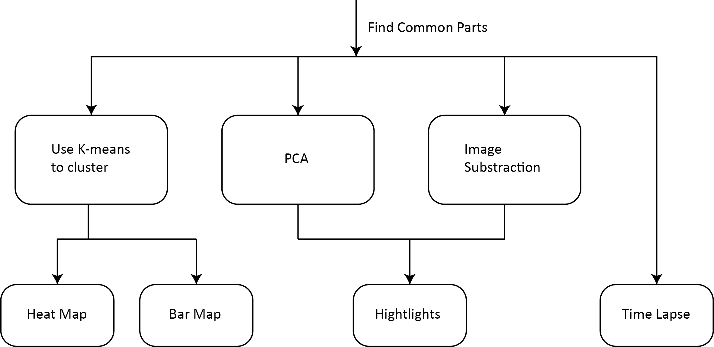   
* Highlights  
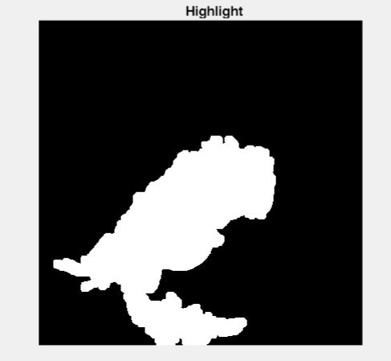  
* K-means Clustering  
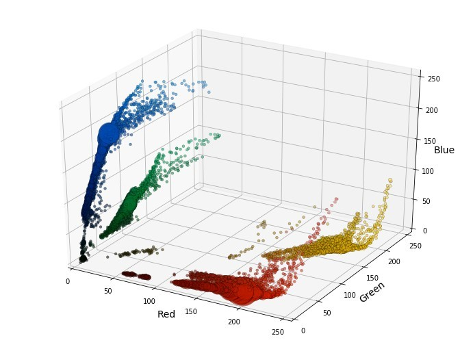  
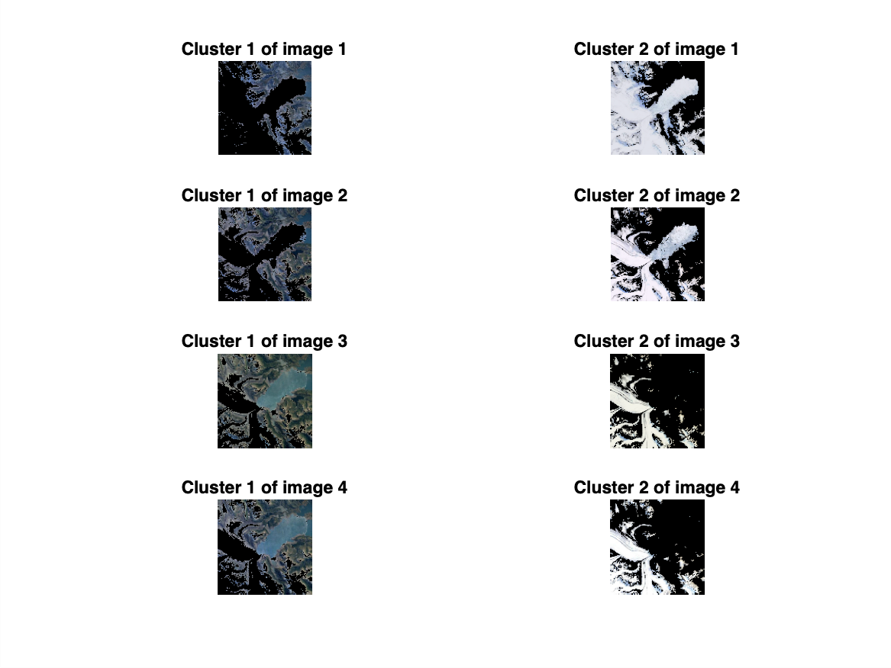  
* Heat Map  
    
  
* Bar Map  
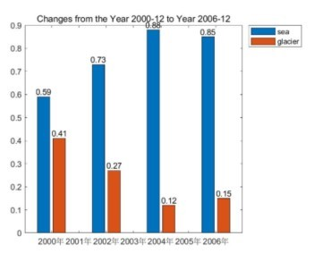  
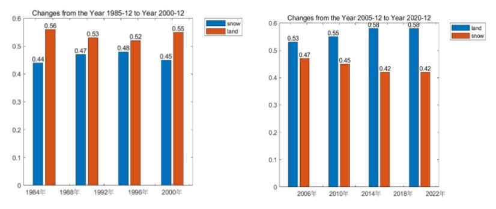  
  
* Time Lapse

## GUI
* GUI Manual  
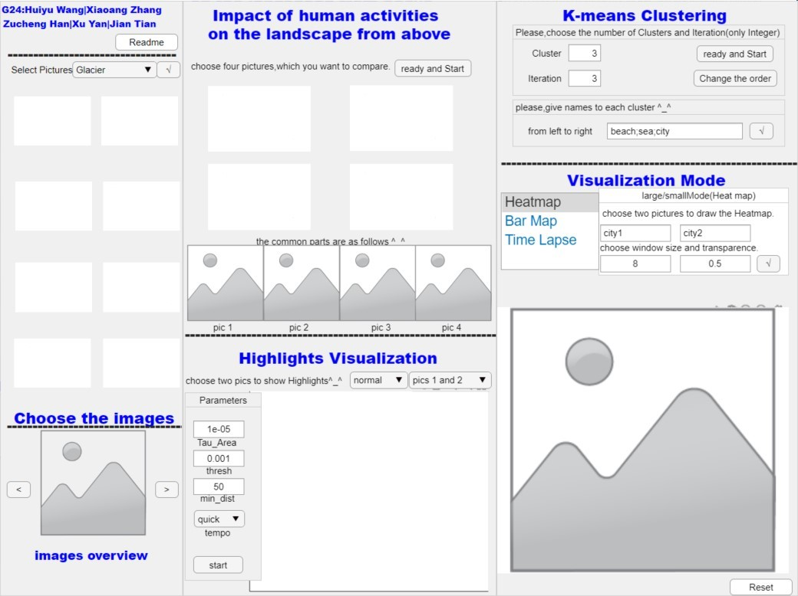  
* Results  
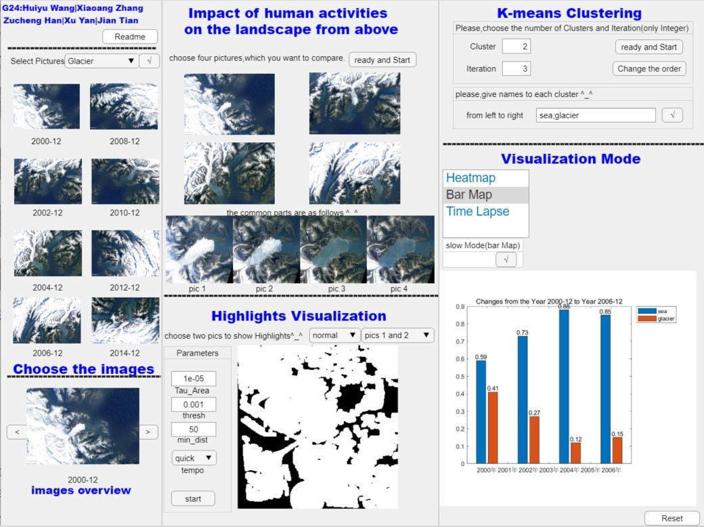  
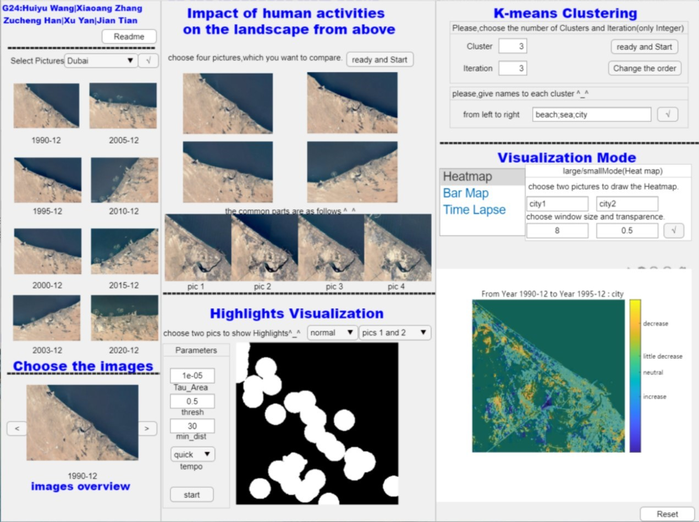  
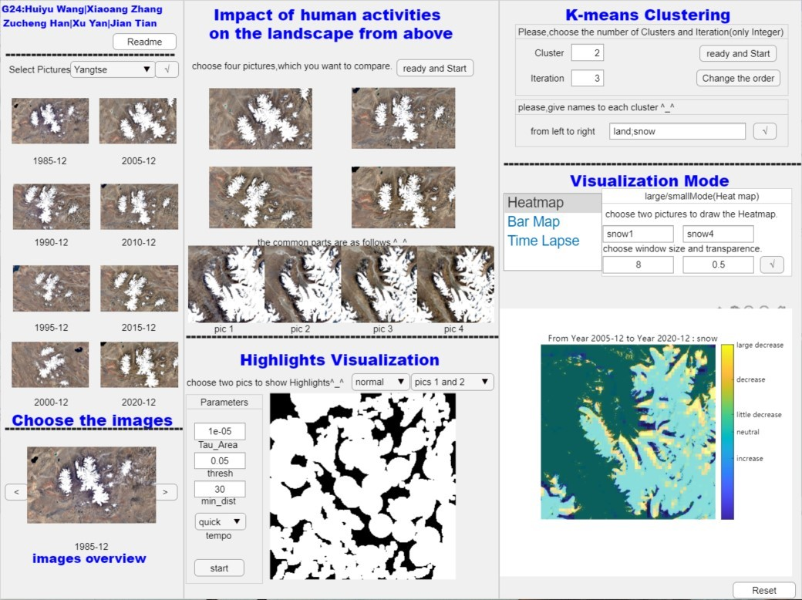  
## Copyright
* [1][Computer Vision](https://www.ce.cit.tum.de/ldv/lehre/computer-vision/)
* [2][tranberg. Determining dominant colors in images using clustering.](https://tberg.dk/post/determining-dominant-colors//)